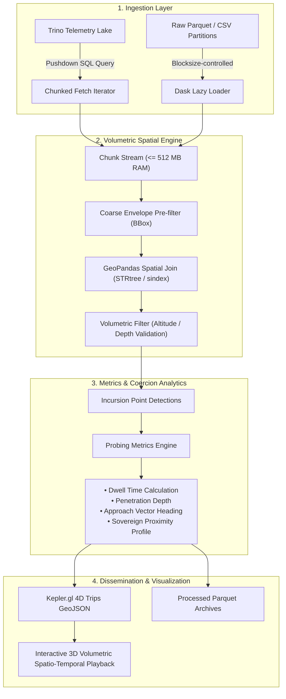

# Project Aurora: Volumetric Sovereignty & Spatial Telemetry Analysis

[](https://github.com/JasperC88/Aurora/actions/workflows/pipeline-validation.yml)
[](https://www.python.org/)
[](https://opensource.org/licenses/MIT)

> **Dissertation Research Codebase**  
> **Target Milestone:** Formative Proposal Submission — **Thursday 12th November 2026**  
> **Development Environment:** Google Antigravity IDE  
> **High-Performance Compute (HPC):** University of Edinburgh (UoE) Eddie Cluster  
> **Repository:** [https://github.com/JasperC88/Aurora](https://github.com/JasperC88/Aurora)

---

## 1. Theoretical Framework: Operationalizing Volumetric Sovereignty

Traditional political science and international relations frameworks have frequently fallen into what geographer John Agnew termed the **"territorial trap"**—treating state sovereignty as flat, two-dimensional Euclidean planes demarcated by terrestrial borderlines. 

**Project Aurora** builds upon **Stuart Elden's theory of *volumetric sovereignty*** (*The Birth of Territory*, 2013; *Secure the Volume*, 2013), conceptualizing sovereign territory not as planar surfaces, but as complex, three-dimensional, and temporally dynamic volumes encompassing:
- **Verticality:** Altitude strata, flight level air defense corridors, and ballistic trajectories.
- **Bathymetry & Sub-surface:** Sub-surface maritime acoustic profiles, underwater sea lines of communication, and continental shelf boundaries.
- **Grey-Zone Coercion & Boundary Probing:** Deliberate sub-threshold state maneuvers calibrated to probe, test, and normalize sovereign erosion without crossing legal tripwires for kinetic retaliation.

```
       =========================================================
       UPPER AIRSPACE / STRATOSPHERE (> 60,000 ft)
       ---------------------------------------------------------
       CONTESTED AIR DEFENSE IDENTIFICATION ZONE (ADIZ)
          ▲  ▲  ▲   [PLA Incursion Vector / Surveillance Loiter]
          │  │  │   • Altitude: FL 240 (24,000 ft)
          │  │  │   • Dwell Time: 35 min
          ▼  ▼  ▼
       ---------------------------------------------------------
       SOVEREIGN NATIONAL AIRSPACE (12 Nautical Miles Baseline)
       =========================================================
       SURFACE LEVEL (Maritime EEZ / Median Line)
       ---------------------------------------------------------
       SUB-SURFACE / BATHYMETRIC VOLUME (GIUK Gap ASW Corridors)
       =========================================================
```

### Empirical Focus: Two Strategic Chokepoints
1. **Taiwan Air Defense Identification Zone (ADIZ) — Southwest Sector & Median Line:**  
   Tracking daily PLA aerial incursions (Y-8 ASW, KJ-500 AEW&C, J-16 multirole fighters) to quantify tactical dwell times, penetration vectors, and escalation cadence.
2. **Greenland-Iceland-United Kingdom (GIUK) Gap — North Atlantic Maritime Corridor:**  
   Tracking naval auxiliary, maritime surveillance, and long-range aviation tracks traversing strategic choke-points between the Arctic and the Atlantic basin.

---

## 2. Computational Architecture

Telemetry datasets (ADS-B aerial transponder records and AIS maritime vessel tracking) are voluminous, noisy, and rapidly exhaust local computer memory when loaded monolithically. Project Aurora implements a **memory-disciplined, chunked spatial pipeline** transitioning smoothly from local prototyping in **Google Antigravity** to cluster-scale execution on the **University of Edinburgh's Eddie HPC**.



---

## 3. Directory Structure

```
Project-Aurora/
├── .agents/
│   └── rules/
│       └── project-aurora.md        # Permanent agent guidelines for Project Aurora
├── .github/
│   └── workflows/
│       └── pipeline-validation.yml  # Automated memory & spatial unit tests
├── cluster/
│   ├── eddie_job.sh                 # SGE batch script for UoE Eddie HPC cluster
│   └── README.md                    # HPC scaling guide and IS request template
├── config/
│   └── regions.geojson              # Spatial polygons & volumetric boundaries
├── data/
│   ├── raw/                         # Raw telemetry (excluded from git)
│   ├── processed/                   # Intersected incursion events (excluded from git)
│   └── samples/
│       └── sample_telemetry.csv     # Lightweight test fixtures for CI/CD
├── notebooks/
│   └── exploration.ipynb            # Interactive research & parameter tuning
├── src/
│   └── aurora/
│       ├── __init__.py
│       ├── ingestion/
│       │   ├── trino_client.py      # Streaming cursor with pushdown bounding box
│       │   └── dask_loader.py       # Dask partitioned data structures
│       ├── spatial/
│       │   ├── batch_runner.py      # Production CLI batch runner
│       │   ├── geometries.py        # Volumetric region manager & envelopes
│       │   ├── spatial_join.py      # Memory-guarded GeoPandas joins
│       │   └── probing_metrics.py   # Dwell time, penetration, and coercion metrics
│       ├── utils/
│       │   └── memory.py            # Real-time RSS memory guards (< 512 MB)
│       └── visualization/
│           └── kepler_formatter.py  # 4D Kepler.gl temporal Trips layer formatter
├── tests/
│   ├── test_chunking.py             # Memory constraint & iterator tests
│   └── test_spatial.py              # Geometric containment & metrics tests
├── .gitignore
├── GEMINI.md                        # Antigravity IDE workspace instructions
├── pyproject.toml                   # Standard Python packaging configuration
├── requirements.txt                 # Pinned dependencies
└── README.md                        # Theoretical & methodology documentation
```

---

## 4. Key Methodological Innovations

### A. Memory-Bounded Stream Processing
Rather than loading entire raw telemetry archives into RAM, `src/aurora/spatial/spatial_join.py` enforces a strict memory ceiling (default **$\le 512$ MB** per chunk during local development) via `MemoryGuard`:
```python
from aurora.spatial.spatial_join import SpatialJoinEngine
from aurora.spatial.geometries import RegionManager

rm = RegionManager("config/regions.geojson")
engine = SpatialJoinEngine(target_region_gdf=rm.to_geodataframe())

# Stream-process 50,000-row chunks sequentially with automatic garbage collection
for incursion_chunk in engine.process_stream(telemetry_chunk_generator):
    persist_chunk(incursion_chunk)
```

### B. High-Speed Envelope Pre-filtering
Before executing computationally intensive polygon point-in-polygon operations, telemetry chunks are filtered against the minimum bounding rectangle (envelope). Points outside the bounding envelope are eliminated instantly without invoking GEOS intersection algorithms.

### C. 4D Kepler.gl Cartographic Visualization
Trajectories are exported as Kepler.gl 4D Trips layers (`[longitude, latitude, altitude_meters, epoch_timestamp]`), enabling 3D temporal playback of boundary-probing tracks over the Taiwan Strait and North Atlantic.

---

## 5. Scaling Strategy: Antigravity IDE to UoE Eddie Cluster

| Dimension | Local / Google Antigravity | UoE Eddie HPC Cluster |
| :--- | :--- | :--- |
| **Role** | Code drafting, algorithm refinement, CI unit testing | High-throughput batch processing of multi-month datasets |
| **Data Scope** | Local slices & synthetic fixtures (`data/samples/`) | Full historical ADS-B & AIS data lake (billions of rows) |
| **Memory Budget** | Strict $\le 512$ MB RAM ceiling per chunk | High-memory nodes (`-l h_vmem=16G` to `64G`) |
| **Execution** | Interactive REPL, Antigravity Agent, `pytest` | Sun Grid Engine batch jobs (`qsub cluster/eddie_job.sh`) |
| **I/O** | Local SSD | Parallel scratch filesystem (`/exports/csce/eddie/...`) |

---

## 6. Quickstart & Installation

### Local Setup
```bash
# Clone repository
git clone https://github.com/JasperC88/Aurora.git
cd Aurora

# Create and activate virtual environment
python3 -m venv venv
source venv/bin/activate

# Install dependencies
pip install -r requirements.txt
pip install -e .
```

### Running Tests
Execute the automated test suite to verify memory guard behavior and geometric calculations:
```bash
pytest -v tests/
```

### Executing Sample Batch Ingestion
Run the spatial batch processor on the bundled sample telemetry dataset:
```bash
python3 -m aurora.spatial.batch_runner \
    --regions config/regions.geojson \
    --input "data/samples/sample_telemetry.csv" \
    --output "data/processed/sample_incursions.csv" \
    --chunk-size 50000 \
    --memory-budget-mb 512
```

---

## 7. Research Roadmap & Milestone Deadlines

- [x] **Phase 1: Architecture Initialization**
  - Establish Antigravity workspace, version control, and repository scaffold.
  - Implement memory guardrails and sample volumetric boundary definitions.
- [ ] **Phase 2: Ingestion & Spatial Calibration** (Oct 2026)
  - Connect Trino streaming client to telemetry data sources.
  - Benchmark spatial join throughput across varying chunk sizes ($10\text{k} - 200\text{k}$ rows).
  - Fine-tune ADIZ Southwest sector and Median Line geometric representations.
- [ ] **Phase 3: Formative Proposal Submission** (**Thursday 12th November 2026**)
  - Submit theoretical proposal establishing the volumetric sovereignty framework supported by preliminary empirical incursion metrics and Kepler.gl cartographic visualizations.
- [ ] **Phase 4: UoE Eddie Cluster Deployment** (Late Nov 2026 – Jan 2027)
  - Request Information Services HPC cluster allocation with proven memory profile.
  - Execute full-scale multi-month telemetry runs across East Asian and North Atlantic theaters.

---

## 8. Citation & Academic Attribution

If utilizing this codebase or spatial methodology, please cite:
```bibtex
@thesis{aurora2026,
  author       = {Jasper},
  title        = {Volumetric Sovereignty and Grey-Zone State Coercion: A Computational Spatial Telemetry Approach},
  school       = {University of Edinburgh},
  year         = {2026},
  note         = {Project Aurora Dissertation Codebase: https://github.com/JasperC88/Aurora}
}
```
